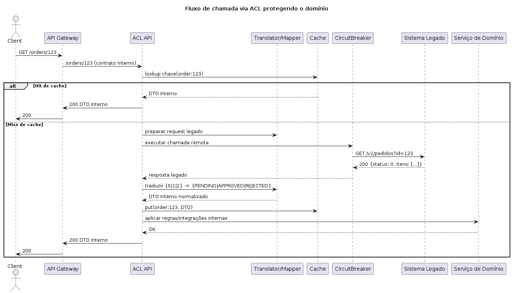

# Camada Anti-Corrupção de API (API Anti-Corruption Layer – ACL)

## Problema  

Em integrações de sistemas, especialmente quando um sistema legado ou externo precisa se comunicar com uma nova aplicação, existe o risco de **“corrupção” do domínio**:  
- Modelos de dados, contratos ou regras de negócio inconsistentes podem vazar do sistema legado para o sistema novo.  
- Isso gera **acoplamento excessivo**, dificultando manutenções, evoluções e trocas de tecnologia.  
- Mudanças no sistema externo podem quebrar o funcionamento interno da aplicação.  

Exemplo: Um sistema legado retorna status de pedido como `0`, `1`, `2`, enquanto a aplicação moderna trabalha com `PENDING`, `APPROVED`, `REJECTED`. Se a aplicação consumir diretamente o legado, herdará inconsistências e complexidade desnecessária.  

---

## Solução  

A **Camada Anti-Corrupção de API (ACL)** é um padrão arquitetural que funciona como uma **faixa de tradução** entre o sistema legado/externo e o sistema moderno:  

- **Traduz modelos de dados** → mapeia o formato legado para o modelo de domínio interno.  
- **Adapta contratos** → converte chamadas de APIs antigas em contratos claros e consistentes para o novo sistema.  
- **Isola regras de negócio** → protege o domínio interno de regras e inconsistências herdadas.  
- **Garante resiliência** → pode aplicar validações, normalizações e fallback antes de entregar os dados ao sistema interno.  

Exemplo prático:  
- Sistema Legado expõe API REST com `status: 0/1/2`.  
- ACL recebe, traduz para `PENDING/APPROVED/REJECTED`.  
- Sistema interno consome a API ACL, sem precisar conhecer detalhes do legado.  

---

## Alternativas  

1. **Adapter Pattern (Padrão de Projeto)**  
   - Uso de adaptadores diretamente no código da aplicação.  
   - Bom para integrações pequenas, mas pode gerar espalhamento de lógica de tradução.  

2. **Facade Pattern**  
   - Criação de uma fachada simplificada que esconde a complexidade do sistema legado.  
   - Útil quando não há muitas diferenças semânticas, mas não tão robusta quanto ACL.  

3. **Middleware de Integração (ESB, API Gateway com transformação)**  
   - Ferramentas como Apigee, MuleSoft, Kong ou API Gateway podem implementar transformações no tráfego.  
   - Boa opção quando a transformação é simples (ex: renomear campos, mascarar dados).  

4. **Event Streaming com Normalização (Kafka, Pub/Sub)**  
   - Receber eventos no formato legado, aplicar transformação/normalização e republicar em formato interno.  
   - Indicado quando a integração é baseada em eventos e não em APIs síncronas.  



# Projeto Exemplo - Camada Anti-Corrupção de API (ACL) em Java

Este repositório demonstra como implementar uma **Camada Anti-Corrupção (Anti-Corruption Layer - ACL)** em Java com Spring Boot e Resilience4j.

## 📌 Objetivo

Proteger o domínio interno de inconsistências vindas de um sistema legado, garantindo:
- Tradução de contratos externos para o modelo de domínio interno.
- Resiliência (retry, circuit breaker, timeouts, fallback).
- Exposição de uma API limpa para consumidores internos.

## 📂 Estrutura do Projeto

```
com.example
 ├─ domain/                # Modelo de domínio limpo (interno)
 ├─ acl/
 │   ├─ api/               # Controllers REST expostos pela ACL
 │   ├─ service/           # Serviços da ACL (resiliência, orquestração)
 │   ├─ mapper/            # Traduções Legacy <-> Domínio
 │   └─ legacy/            # Contratos e cliente do sistema legado
 └─ config/                # Configurações transversais (cache, resilience, etc.)
```

## 🚀 Executando o Projeto

### Pré-requisitos
- **Java 17+**
- **Maven 3.9+**

### Passos
1. Clone o repositório `.zip` e extraia em uma pasta.
2. Compile e rode os testes:
   ```bash
   mvn clean install
   ```
3. Rode a aplicação:
   ```bash
   mvn spring-boot:run
   ```
4. Acesse o endpoint da ACL:
   ```bash
   curl http://localhost:8080/api/orders/123
   ```

## 🔧 Configuração

As propriedades de configuração do sistema legado ficam no `application.yml`:
```yaml
legacy:
  base-url: https://legacy.example.com

resilience4j:
  circuitbreaker:
    instances:
      legacy:
        sliding-window-type: COUNT_BASED
        sliding-window-size: 10
        failure-rate-threshold: 50
        wait-duration-in-open-state: 30s
  retry:
    instances:
      legacy:
        max-attempts: 3
        wait-duration: 200ms
  timelimiter:
    instances:
      legacy:
        timeout-duration: 3s
```

## ✅ Testes

Exemplo de teste de unidade para validação do **Mapper**:
```bash
mvn test
```

## 🔄 Alternativas

- **Adapter/Facade no próprio serviço** (mais simples, mas acoplado).
- **Transformação em API Gateway/ESB** (Apigee, Kong, MuleSoft).
- **ACL por eventos (Kafka/Pub/Sub)** em vez de APIs síncronas.

---
📖 Este projeto é apenas um exemplo educacional para demonstrar como proteger o domínio interno de sistemas legados usando a Camada Anti-Corrupção.